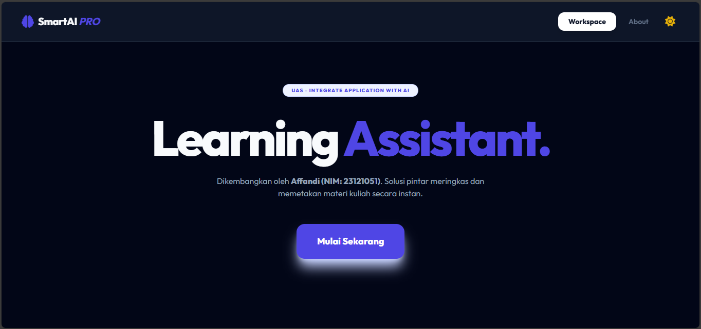

# EduSmart AI Pro — Personal Intelligence Learning System
**Oleh: Affandi (NIM: 23121051)**
**UAS: Integrate Application with AI (Januari 2026)**

---

## Tampilan Aplikasi

*Antarmuka modern dengan dukungan Dark/Light Mode dan Visualisasi Mind Map Otomatis.*

---

## Deskripsi Proyek
**EduSmart AI Pro** adalah platform asisten akademik berbasis Web yang mengintegrasikan kecerdasan buatan (AI) untuk membantu mahasiswa mengoptimalkan proses belajar. Aplikasi ini dirancang untuk menyelesaikan masalah beban kognitif saat membaca materi kuliah yang panjang melalui fitur otomatisasi ringkasan, visualisasi konsep, dan pembuatan kuis adaptif.

### Pemenuhan Kriteria Penilaian UAS
* **Integrasi AI Multimodal:** Menggunakan engine **Google Gemini 1.5 Flash** untuk pemrosesan teks yang cepat dan akurat.
* **Orisinalitas:** Dikembangkan secara mandiri dengan identitas pengembang (Nama & NIM) yang terintegrasi di setiap komponen UI.
* **Keamanan:** Menerapkan manajemen *environment variables* (`.env`) untuk melindungi kredensial API Key sesuai standar keamanan perangkat lunak.
* **Statis & Efisien:** Berjalan di server lokal tanpa ketergantungan database eksternal sesuai instruksi tugas.

---

## Fitur Unggulan
1.  **Smart Summary:** Algoritma ekstraksi teks untuk merangkum jurnal atau materi kuliah menjadi poin-poin akademik yang terstruktur.
2.  **Mind Matrix (Visual):** Menghasilkan bagan alur konsep secara otomatis menggunakan *Mermaid.js* berdasarkan analisis teks AI.
3.  **AI Quiz Generator:** Membuat soal pilihan ganda tingkat perguruan tinggi lengkap dengan kunci jawaban untuk evaluasi mandiri.
4.  **Professional UI/UX:** Antarmuka modern dengan *Tailwind CSS*, mendukung *Splash Screen* personal, serta mode *Dark/Light* yang kontras.
5.  **Smart Export:** Fitur konversi hasil analisis AI langsung ke format PDF yang rapi menggunakan *html2pdf.js*.

---

## Arsitektur Teknologi
* **Core Engine:** Python 3.x dengan Framework Flask.
* **AI Model:** Google Gemini 1.5 Flash API (SDK Resmi).
* **Frontend:** HTML5, CSS3 (Tailwind CSS), JavaScript (ES6+).
* **Libraries Utama:** `flask-cors`, `python-dotenv`, `mermaid.js`, `google-generativeai`.

---

## Panduan Instalasi & Penggunaan

### 1. Persiapan Lingkungan
Clone repository ini dan pastikan Anda telah menginstal Python di sistem Anda. Kemudian instal library yang diperlukan:
```bash
pip install -r requirements.txt